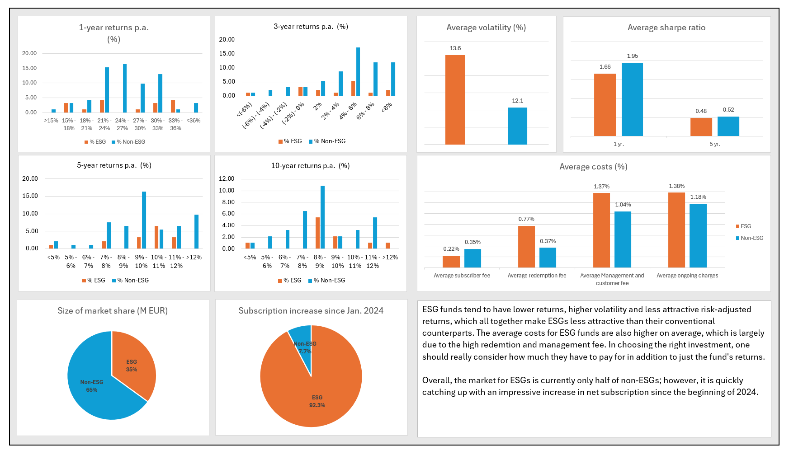

# Portfolio
## Below are my projects
### **My LinkedIn profile**: [Huong Do](https://www.linkedin.com/in/thixuanhuongdo/)

- [x] **Python** - **Game data analytics**
      
  *Download the CSV files*: [HERE](https://www.kaggle.com/datasets/debs2x/gamelytics-mobile-analytics-challenge/data)
      
  *Review the Jupyter Notebook solution*: [HERE](https://github.com/huongtxdo/dropRate_vs_pullTime/blob/71b50178d21d187e1842ea2677f530b58643dbb1/Jupyter%20Notebook%20solution.ipynb)

- [x] **Python** - **Analyzing Gacha's drop rate - Machine learning project**
      
  *Download the Excel file*: [HERE](https://github.com/huongtxdo/Game-data-anlytics/tree/main/notebooks)
      
  *Review the Jupyter Notebook solution*: [HERE](https://github.com/huongtxdo/dropRate_vs_pullTime/blob/71b50178d21d187e1842ea2677f530b58643dbb1/Jupyter%20Notebook%20solution.ipynb)

- [x] **Excel** - **Analyzing performance of ESG vs non-ESG funds**
      
  *Download the Excel file*: [HERE](https://github.com/huongtxdo/Portfolio/blob/292424ee0525379fb7b36859fdbc992ae4e5444b/Mutual%20fund%20report%20(macro-ebabled).xlsm)

- [x] **SQL * Power BI** - **Global electricity production**
      
*Download the dataset*: [HERE](https://github.com/huongtxdo/Global-electricity-production/blob/main/global_electricity_production_data.csv)

  *Review the project*: [HERE](https://github.com/huongtxdo/Global-electricity-production/tree/main)

- [x] **Python & SQL** - **Vaccine distribution**
      
  *Download the Excel file*: [HERE](https://github.com/huongtxdo/vaccine-distribution/blob/a0676e83512cb862f01aae98b576cdb782d00808/data/vaccine-distribution-data.xlsx)
      
  *Review the SQL and Python script*: [HERE](https://github.com/huongtxdo/vaccine-distribution/tree/a0676e83512cb862f01aae98b576cdb782d00808/code)

- [x] **SQL** - **Analyzing Webtoon**
      
  *Review the data: [HERE](https://github.com/huongtxdo/SQL-analyzing-Webtoon/blob/07a6368d288c252df7319bcf1306403974ab1093/webtoon_originals_en.csv)
      
  *Review the data exploration - SQL script*: [HERE](https://github.com/huongtxdo/SQL-analyzing-Webtoon/blob/07a6368d288c252df7319bcf1306403974ab1093/solution.md)

